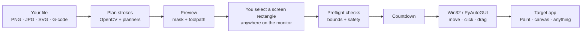

<div align="center">

# JoensAutoDraw

**Turn any image or vector file into real mouse-drawn strokes — anywhere on your Windows screen.**

[](https://github.com/joenb33/JoensAutoDraw/actions/workflows/ci.yml)
[](https://github.com/joenb33/JoensAutoDraw/releases/latest)
[](LICENSE)
[](https://www.python.org/)
[](https://github.com/joenb33/JoensAutoDraw)

Point JoensAutoDraw at **MS Paint**, a **browser canvas**, **Photoshop**, **Krita**, or any app that draws with the **left mouse button**.  
You pick a **screen rectangle** — the drawing happens **inside that area, at absolute screen coordinates**. Not tied to one window. Not tied to one app.

[Download latest `.exe`](https://github.com/joenb33/JoensAutoDraw/releases/latest) · [How it works](#how-it-works) · [Quick start](#quick-start) · [Safety](#safety)

</div>

---

> **Use responsibly.** Automate only where it is permitted. You are responsible for app terms and local laws.

---

## How it works

JoensAutoDraw is a **plan → validate → draw** pipeline that runs entirely on your PC. No cloud. No account. No injection into other processes — it controls the **same mouse cursor you use**, like a very precise robot hand.



### In plain language

1. **Import** — load a raster image or vector/CNC file.  
2. **Plan** — convert it to stroke paths (horizontal scan lines or contour outlines).  
3. **Select area** — drag a rectangle **anywhere on your screen** (full-screen overlay). This is your canvas — coordinates are mapped from the image into that rectangle.  
4. **Preflight** — verify the plan fits inside your rectangle before the mouse moves.  
5. **Draw** — move the cursor, press the left button, drag along the path, lift the pen between strokes.  
6. **Stop anytime** — `ESC`, or slam the cursor into the screen’s top-left corner.

### Draw anywhere on screen

The draw area is **not** locked to a specific window handle or HWND. You define a **pixel rectangle in screen space** — for example over MS Paint’s canvas, a Google Canvas tab, a second monitor, or a region inside a zoomed UI.

| You control | What AutoPaint does |
|-------------|---------------------|
| **Where** on the monitor | Maps image coordinates → screen pixels inside your rectangle |
| **How big** the drawing is | Aspect ratio preserved; image is fitted inside the selection |
| **Which app** receives input | Whatever app is under the cursor when drawing runs — **focus that app first** |

> **Tip:** Open your target app, select brush/color there, then select the screen area that covers its drawable surface. JoensAutoDraw does not change pen color yet (see [Roadmap](#roadmap)).

---

## Technology stack

Everything below is used in this repo today:

| Layer | Technology | Role |
|-------|------------|------|
| **Language** | Python 3.10+ | Core application |
| **Desktop GUI** | [CustomTkinter](https://github.com/TomSchimansky/CustomTkinter) + Tkinter | Dark control panel, sliders, previews |
| **Image I/O & CV** | [OpenCV](https://opencv.org/) (`opencv-python`) | Load/decode images, blur, threshold, contours, preview rendering |
| **Arrays** | [NumPy](https://numpy.org/) | Binary masks, coordinate math |
| **Pillow** | [PIL](https://python-pillow.org/) | GUI preview thumbnails |
| **Vector import** | [svgelements](https://github.com/meerk40t/svgelements) | Parse SVG paths |
| **CNC import** | Custom G-code parser | `G0`/`G1` motion, pen-up heuristics |
| **Mouse automation** | [PyAutoGUI](https://pyautogui.readthedocs.io/) | Cross-app mouse down/up semantics |
| **Low-level input** | Win32 `SetCursorPos` + `mouse_event` via `ctypes` | Fast, reliable cursor moves on Windows |
| **Emergency stop** | Win32 `GetAsyncKeyState` + [`keyboard`](https://github.com/boppreh/keyboard) | Poll `ESC` during draw and countdown |
| **Packaging** | [PyInstaller](https://pyinstaller.org/) | Single-file `.exe` for releases |
| **Tests** | [pytest](https://pytest.org/) | Planner, pipeline, drawer, validation |
| **CI / Release** | GitHub Actions | PR tests + auto bump/build/release on every push to `main` |
| **Auto-update** | GitHub Releases API | Packaged `.exe` checks for updates on startup |

### Internal modules (Python package `autopaint/`)

| Module | Responsibility |
|--------|----------------|
| `image_processing.py` | Grayscale load (Unicode-safe paths), Gaussian blur, threshold |
| `planner.py` | Horizontal **segments** + OpenCV **contours** + Douglas–Peucker simplification |
| `vector_import.py` | SVG sampling, G-code polylines |
| `toolpath.py` | Stroke list → `move / down / draw / up` commands |
| `pipeline.py` | Shared plan, travel optimization, preflight, execute |
| `drawer.py` | Aspect-fit mapping, pixel walking, batched drag execution |
| `validation.py` | Preflight bounds and area checks |
| `failsafe.py` | ESC + interruptible countdown |
| `gui.py` | Desktop workflow UI |
| `main.py` | CLI entry point |

---

## Download (easiest)

1. Go to **[Releases](https://github.com/joenb33/JoensAutoDraw/releases/latest)**.  
2. Download **`JoensAutoDraw.exe`** (or the `.zip`).  
3. Double-click — no Python install required.  
4. Follow the [GUI workflow](#gui-workflow) below.

> Windows SmartScreen may warn on unsigned executables. Choose **More info → Run anyway**, or run from source if you prefer.

---

## Quick start (from source)

```powershell
git clone https://github.com/joenb33/JoensAutoDraw.git
cd JoensAutoDraw

python -m venv .venv
.venv\Scripts\Activate.ps1
pip install -r requirements.txt

python -m autopaint.gui
```

Try the CLI with the bundled sample:

```powershell
python -m autopaint.main --image ".\examples\cat.png" --preview --dry-run
```

---

## GUI workflow

```
Browse → Build Plan → Select Area → Dry Run → Draw Now
```

| Step | Action |
|------|--------|
| **1. Browse** | Pick PNG, JPG, SVG, G-code, etc. |
| **2. Build Plan** | Tune threshold / mode; inspect **Planned Preview** |
| **3. Select Area** | Full-screen overlay — drag a box **anywhere on screen** over your canvas |
| **4. Dry run** | Leave checked first; confirm log output |
| **5. Draw Now** | Uncheck dry run when ready; keep **ESC** handy |

**Emergency stop:** `ESC` · or move mouse to **top-left screen corner**

---

## Drawing modes

| Mode | Best for | Output style |
|------|----------|--------------|
| **Contour** | Line art, SVG, CNC paths | Outline polylines with pen-up travel between paths |
| **Hatch** | Engraver-style fills | Continuous fill lines across the mask at a chosen angle/spacing |
| **Segments** | Simple filled logos/bold shapes | Horizontal scan-line fill — reliable but more fragmented |

Vector files always run as **contour**. Hatch/segment modes on vectors fall back to contour automatically.

---

## CLI reference

```powershell
python -m autopaint.main --image ".\examples\cat.png" --mode contour --dry-run
```

| Flag | Default | Description |
|------|---------|-------------|
| `--image` | required | Source path |
| `--mode` | `contour` | `contour`, `hatch`, or `segments` |
| `--threshold` | `140` | Binarization 0–255 |
| `--blur` | `5` | Gaussian kernel (odd) |
| `--step` | `2` | Segment row step |
| `--hatch-spacing` | `6` | Hatch/fill line spacing in source pixels |
| `--hatch-angle` | `0` | Hatch/fill angle in degrees |
| `--hatch-gap` | `2` | Max off-mask gap bridged inside hatch strokes |
| `--contour-epsilon` | `1.2` | Contour simplification |
| `--speed` | `0.002` | Move duration (seconds) |
| `--dry-run` | off | No mouse movement |
| `--target-rect` | dry-run only | Explicit screen rectangle as `left,top,right,bottom` |
| `--preview` | off | OpenCV preview windows |

Full list: `python -m autopaint.main --help`

In CLI dry-run mode, JoensAutoDraw uses a source-sized virtual target when
`--target-rect` is omitted, so the command can run without mouse-position prompts.
For a real draw, omit `--target-rect` to capture corners interactively or pass exact
screen coordinates yourself.

---

## Automatic releases

Every push to **`main`** triggers the release workflow:

1. Run the full pytest suite  
2. Bump the patch version in `autopaint/__init__.py` (`0.1.0` → `0.1.1`)  
3. Commit `chore(release): bump version to …` and create a git tag  
4. Build `JoensAutoDraw.exe` and publish a GitHub Release  

Pull requests run the same tests via CI **without** creating a release.

Skip a release bump by starting your commit message with `[skip release]` *(future)* — release commits from the bot (`chore(release): …`) are ignored automatically.

---

## Auto-update (packaged `.exe` only)

When you run **`JoensAutoDraw.exe`**, the app checks  
[GitHub Releases](https://github.com/joenb33/JoensAutoDraw/releases/latest) on startup.

| Step | What happens |
|------|----------------|
| 1 | Compare local version vs latest release |
| 2 | If newer → offer to download |
| 3 | Download `JoensAutoDraw.exe` in the background |
| 4 | Restart to apply (replaces the running executable) |

Running from source (`python -m autopaint.gui`) skips update checks.  
Set `JOENSAUTODRAW_SKIP_UPDATE=1` to disable checks in the packaged app.

---

## Build your own `.exe`

```powershell
pip install -r requirements-build.txt
pyinstaller --noconfirm JoensAutoDraw.spec
# Output: dist/JoensAutoDraw.exe
```

Local builds use the version in `autopaint/__init__.py`.

---

## Safety

| Layer | Mechanism |
|-------|-----------|
| Dry run | Default in GUI — plan without moving the mouse |
| Preflight | Validates area size, paths, and screen bounds before draw |
| Countdown | Configurable delay; ESC works during countdown |
| ESC stop | Win32 + keyboard polling |
| Corner fail-safe | PyAutoGUI abort at screen `(0,0)` |
| Bounds guard | Stops if any pixel would leave your selected rectangle |
| Mouse cleanup | Releases left button on error/interrupt |

Details: [docs/SAFETY.md](docs/SAFETY.md)

---

## Troubleshooting

| Problem | Try |
|---------|-----|
| Dots instead of lines | Lower **Speed** (~40–70); keep **Compatibility mode** on |
| Nothing appears | Focus the target app; area must cover the canvas; dry-run first |
| Wrong position | Reselect area after moving/scrolling the target window |
| Tool menus pop up | Avoid selecting an area at the screen’s top-left corner |
| Web canvas blocked | Many sites block synthetic input — use only where allowed |

---

## Development

```powershell
pip install -r requirements-dev.txt
python -m pytest tests/ -v --tb=short
```

GitHub Actions uses `windows-2022` runners with Node.js 24-compatible action settings to avoid deprecation warnings.

- [Usage guide](docs/USAGE.md)  
- [Architecture](docs/ARCHITECTURE.md)  
- [Safety model](docs/SAFETY.md)

---

## Roadmap

- [ ] Multi-color / pen palette switching  
- [ ] Per-app presets (MS Paint, browser canvas, …)  
- [ ] Pause when active window changes  
- [ ] Quality vs speed profiles  

---

## License

MIT © [Joen Berg](https://github.com/joenb33) — see [LICENSE](LICENSE).
