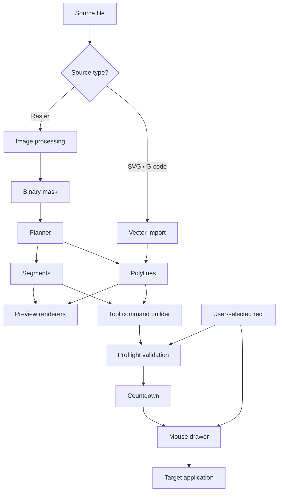

# Architecture

AutoPaint converts raster or vector sources into mouse-driven strokes inside a user-defined screen rectangle. The CLI and GUI share the same planning and execution pipeline.

---

## High-level flow



---

## Execution pipeline

Both interfaces call the same functions in `autopaint/pipeline.py`:

| Stage | Function | Purpose |
|-------|----------|---------|
| Plan | `create_plan()` | Load source, build segments/polylines, previews, base tool commands |
| Prepare | `build_execution_commands()` | Pick mode, apply travel ordering, emit final command list |
| Validate | `preflight_draw()` | Check area size, path content, screen bounds |
| Draw | `execute_draw()` → `draw_tool_commands()` | Countdown, then mouse automation |

### Travel optimization

When `optimize_contour_travel` is enabled, polylines are reordered with a greedy nearest-endpoint heuristic (`_order_polylines_for_travel`) before conversion to tool commands. The GUI travel preview uses the same ordering.

---

## Module reference

### `autopaint/main.py`

CLI entry point: argument parsing, config construction, preview windows, error handling with distinct exit codes.

### `autopaint/gui.py`

CustomTkinter control center: parameter sliders, workflow status, threaded plan/draw workers, in-app previews, fullscreen area selector overlay.

### `autopaint/pipeline.py`

Shared orchestrator for CLI and GUI. Owns `PlanResult`, `create_plan()`, `build_execution_commands()`, `preflight_draw()`, and `execute_draw()`.

### `autopaint/image_processing.py`

Loads grayscale images via `imdecode` (Unicode-safe paths on Windows), applies Gaussian blur and threshold, optional OpenCV preview windows.

### `autopaint/planner.py`

| Output | Method | Description |
|--------|--------|-------------|
| Segments | `mask_to_segments()` | Horizontal run-length strokes with gap bridging |
| Polylines | `mask_to_contour_polylines()` | OpenCV `findContours` |
| Simplified polylines | `simplify_polylines()` | Douglas–Peucker via `approxPolyDP` |

### `autopaint/vector_import.py`

| Format | Behavior |
|--------|----------|
| SVG | Sampled via `svgelements`, split at large jumps |
| G-code | Parses `G0`/`G1`, optional `M3`/`M5` pen state |

All vector paths are normalized to a local origin before planning.

### `autopaint/toolpath.py`

Converts `Segment` or `Polyline` lists into ordered `ToolCommand` sequences:

```text
move → down → draw → draw → … → up
```

### `autopaint/drawer.py`

Coordinate mapping and mouse execution:

- **Fit transform** — aspect-preserving scale into the target rectangle
- **Pixel walking** — `_expand_float_segment` prevents sub-pixel collapse when scaling down
- **Stroke batching** — accumulates a full stroke, densifies sparse anchors, then move → mouse-down → drag → mouse-up
- **Simulation** — `simulate_tool_commands()` mirrors draw timing for GUI stats

Legacy helpers `draw_segments()` and `draw_polylines()` remain for reference; production execution uses `draw_tool_commands()`.

### `autopaint/validation.py`

Preflight checks before any mouse button is pressed:

- Minimum draw area size
- Non-empty drawable content
- Mapped coordinates stay inside the selected rectangle
- Fail-safe zone warning near screen `(0,0)`

Raises `DrawValidationError` with actionable messages.

### `autopaint/failsafe.py`

- ESC polling via Win32 `GetAsyncKeyState` and the `keyboard` package
- Interruptible countdown (ESC checked every 50 ms)
- Raises `EmergencyStop` on user abort

### `autopaint/config.py`

Immutable dataclasses: `ProcessingConfig` (image/vector tuning) and `DrawConfig` (timing, dry-run, compatibility mode).

### `autopaint/types.py`

Core datatypes: `Point`, `Segment`, `Polyline`, `Rect`, `ToolCommand`.

---

## Data contracts

```python
Segment(y, x_start, x_end)      # One horizontal stroke in source pixels
Polyline(points: tuple[Point])  # Ordered vertex list
Rect(left, top, right, bottom)  # Screen-space draw boundary
ToolCommand(kind, x?, y?)       # move | down | draw | up
```

---

## Coordinate mapping

Source coordinates `(x, y)` map into the target rectangle with uniform scale (preserve aspect ratio) and centering:

```text
scale = min(target_w / src_span_x, target_h / src_span_y)
screen_x = offset_x + x * scale
screen_y = offset_y + y * scale
```

Every emitted screen pixel is checked against `Rect` before execution.

---

## Testing

Tests live in `tests/` and cover:

- Planner output (segments, contours, simplification)
- Coordinate mapping and pixel walking
- Pipeline plan/build/preflight
- Validation and failsafe helpers

Run: `python -m pytest tests/ -v`

---

## Design notes

### Why two drawing modes?

| Mode | Strength | Trade-off |
|------|----------|-----------|
| **Segments** | Fast fill, very reliable in MS Paint | Visible scan-line aesthetic |
| **Contour** | Clean outlines, natural for vectors | More pen-up travel, more tuning |

### Why tool commands?

A single `ToolCommand` stream is used for planning stats, preflight bounds checks, and execution. Strokes are batched at execution time so compatibility-mode decimation applies per full stroke, not per short edge.

### Extension points

Future features (multi-color, app presets, window-focus watchdog) can hook into:

- `toolpath.py` — insert color-change commands
- `pipeline.py` — preflight / execute wrappers
- `drawer.py` — app-specific input backends
